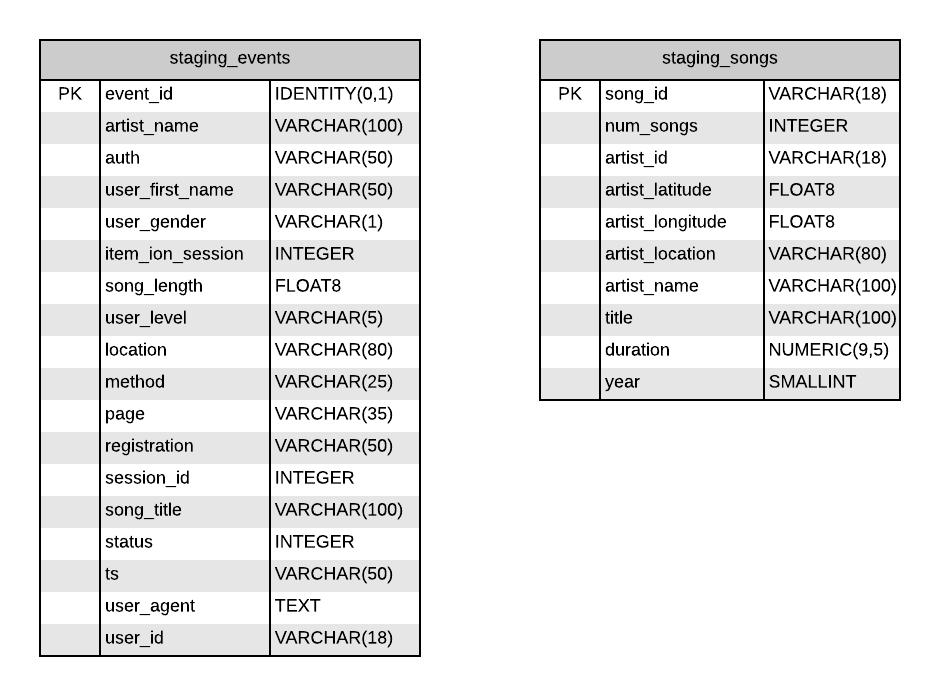
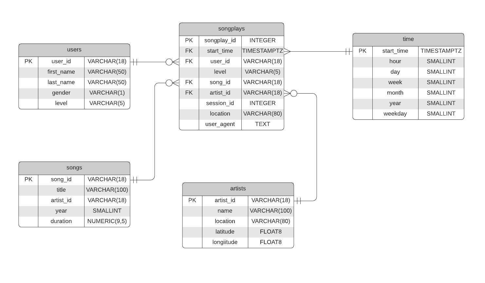

# dwh-redshift
ETL pipeline for a DWH hosted on Redshift

# AWS Credentials
We are using aws as environment variables in this repo:
```
export AWS_ACCESS_KEY_ID=<YOUR_AWS_ACCESS_KEY_ID>
export AWS_SECRET_ACCESS_KEY=<YOUR_AWS_SECRET_ACCESS_KEY>
export AWS_DEFAULT_REGION=<YOUR_REGION>
```

# Creating Infrastucture

## IAM
Create IAM roles for Redshift, run file: `iam.py`. It will create a role for Redshift with s3 Read access

## Redshift
Creates Redshift cluster and add Ingress rule for TCP connection on port 5439. Run file `redshift.py`

## S3
Upload all dataset to s3. Run `load_s3.py`

# Schemas

## Data in S3
This data will pass trough an ETL to be stored in Redshift

## Datawarehouse Schema

